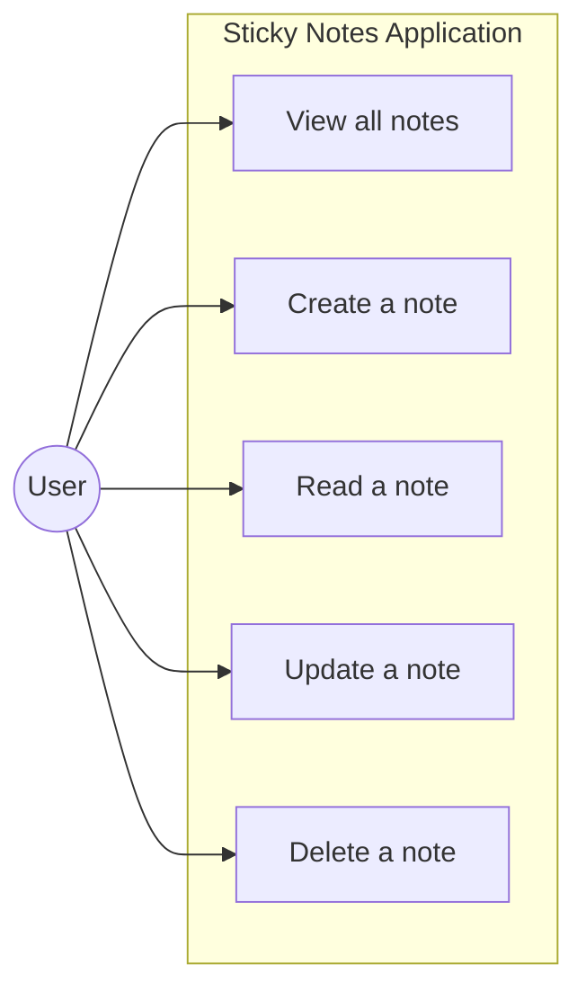
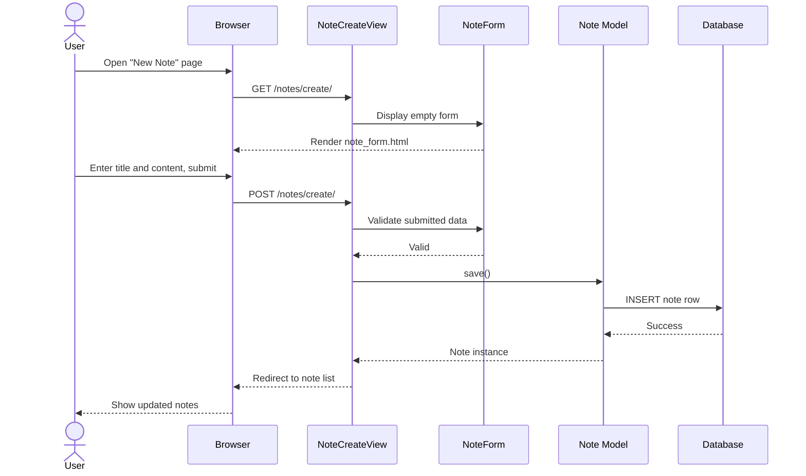
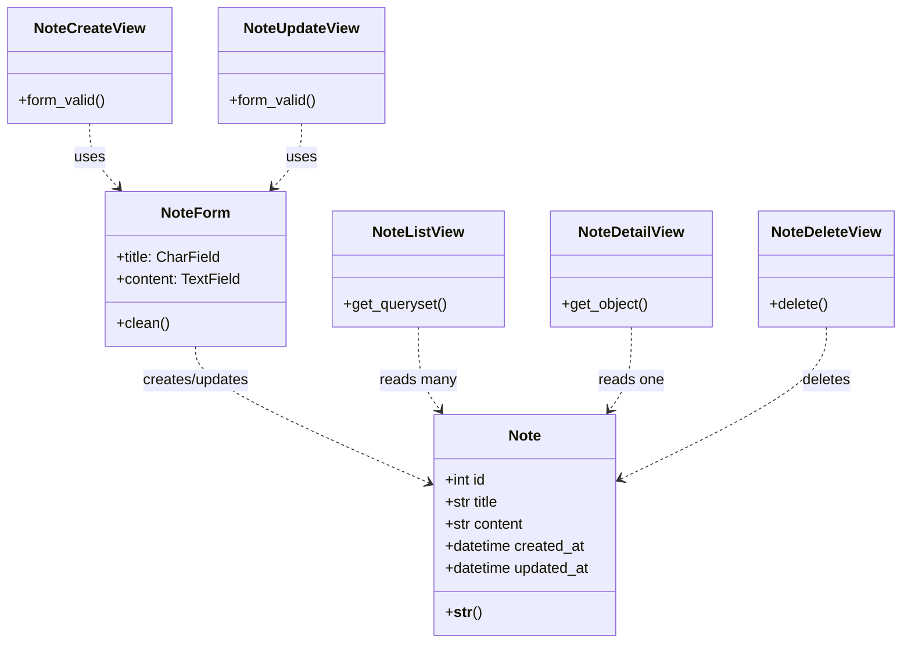

# Sticky Notes Application – Design Diagrams

These diagrams support the Django **sticky_notes** project. You can view them in
any Mermaid-compatible viewer (e.g. [mermaid.live](https://mermaid.live)) or
export them as PNG/PDF for submission.

---

## 1. Use Case Diagram

**Description:** A user interacts with the application to manage personal sticky
notes. All five CRUD operations are available from the web interface.

---

## 2. Sequence Diagram – Create a Note

---

## 3. Class Diagram

---

## Design principles applied

| Principle | How it is used |
|-----------|----------------|
| **Separation of concerns** | Models (data), views (logic), templates (presentation), forms (validation) |
| **DRY** | `base.html` extended by all page templates |
| **Layered architecture** | Presentation → Business (views) → Persistence (models/DB) |
| **CRUD** | Full create, read, update, delete for notes |
